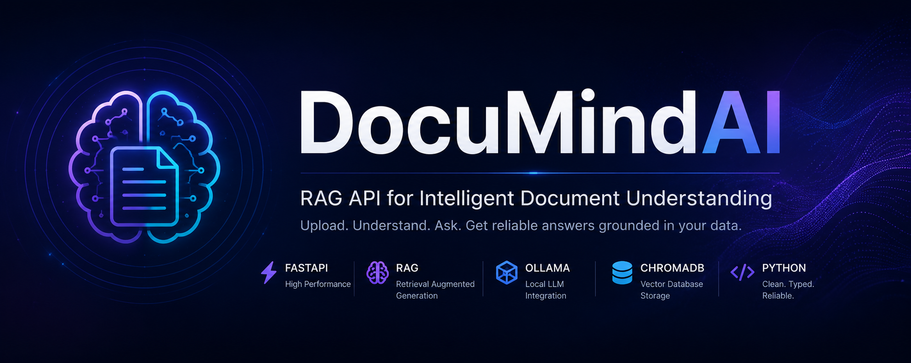
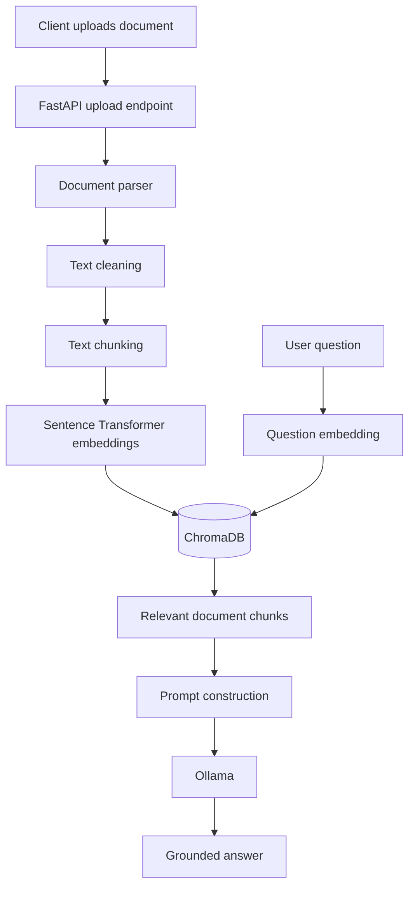

<p align="center">
  
</p>

# DocuMindAI

<p align="center">
  <strong>Production-ready Retrieval-Augmented Generation API for document intelligence.</strong>
</p>

<p align="center">
  Upload documents, perform semantic search, and generate grounded answers with FastAPI, ChromaDB, Sentence Transformers, and Ollama.
</p>

<p align="center">
  <a href="https://github.com/thragg121/DocuMindAI/actions/workflows/ci.yml">
    
  </a>
  
  
  
  
  
</p>

---

## Overview

DocuMindAI is a portfolio-grade backend service that implements a complete
Retrieval-Augmented Generation pipeline.

The application accepts PDF, DOCX, and TXT documents, extracts and cleans their
text, splits the content into searchable chunks, generates vector embeddings,
and stores them in ChromaDB. User questions are matched against the most
relevant chunks and sent to a local Ollama model to produce grounded answers.

The project focuses on clean architecture, explicit error handling, static
typing, automated testing, containerization, and continuous integration.

## Key Features

- Upload PDF, DOCX, and TXT documents
- Extract and normalize document text
- Split content into overlapping chunks
- Generate embeddings with Sentence Transformers
- Store and query vectors with ChromaDB
- Perform document-scoped semantic search
- Generate context-grounded answers with Ollama
- Validate requests and responses with Pydantic
- Explore the API through Swagger UI
- Run locally or with Docker
- Verify code with Ruff, Black, isort, mypy, and pytest
- Run all quality checks automatically with GitHub Actions

## RAG Pipeline



## Technology Stack

| Area | Technology |
|---|---|
| Language | Python |
| API framework | FastAPI |
| Validation | Pydantic |
| Vector database | ChromaDB |
| Embeddings | Sentence Transformers |
| Language model runtime | Ollama |
| PDF parsing | PyMuPDF |
| DOCX parsing | python-docx |
| Testing | pytest |
| Linting | Ruff |
| Formatting | Black |
| Import sorting | isort |
| Static typing | mypy |
| Containers | Docker |
| Continuous integration | GitHub Actions |

## API Endpoints

| Method | Endpoint | Purpose |
|---|---|---|
| `GET` | `/health` | Verify application health |
| `POST` | `/documents/upload` | Upload, parse, chunk, embed, and index a document |
| `POST` | `/search` | Find semantically relevant chunks |
| `POST` | `/chat` | Generate a grounded answer from indexed content |

Interactive documentation is available after startup:

- Swagger UI: `http://localhost:8000/docs`
- ReDoc: `http://localhost:8000/redoc`

## Project Structure

```text
DocuMindAI/
├── .github/
│   └── workflows/
│       └── ci.yml
├── app/
│   ├── api/
│   │   ├── routes/
│   │   └── router.py
│   ├── core/
│   │   ├── config.py
│   │   └── logging.py
│   ├── schemas/
│   ├── services/
│   │   ├── document_parser.py
│   │   ├── document_service.py
│   │   ├── embedding_service.py
│   │   ├── llm_service.py
│   │   ├── search_service.py
│   │   ├── text_chunker.py
│   │   └── vector_store.py
│   ├── utils/
│   └── main.py
├── tests/
│   └── api/
├── Dockerfile
├── docker-compose.yml
├── pyproject.toml
├── pytest.ini
├── requirements.txt
├── requirements-dev.txt
└── README.md
```

## Prerequisites

Before running the complete application, install:

- Python 3.12
- Git
- Ollama
- Docker Desktop, when using Docker

Make sure the required Ollama model is available locally.

```bash
ollama list
```

To download a configured model, use:

```bash
ollama pull <model-name>
```

Use the model name configured in the project's environment variables.

## Local Installation

Clone the repository:

```bash
git clone https://github.com/thragg121/DocuMindAI.git
cd DocuMindAI
```

Create and activate a virtual environment.

### Windows PowerShell

```powershell
python -m venv .venv
.venv\Scripts\Activate.ps1
```

### Linux or macOS

```bash
python -m venv .venv
source .venv/bin/activate
```

Install dependencies:

```bash
python -m pip install --upgrade pip
pip install -r requirements.txt
```

Install development tools when working on the project:

```bash
pip install -r requirements-dev.txt
```

Create the local environment file from the project's example configuration if
one is provided, then adjust the values for your machine.

Start the API:

```bash
uvicorn app.main:app --reload
```

Open:

```text
http://localhost:8000/docs
```

## Docker

Build and start the application:

```bash
docker compose up --build
```

Stop the services:

```bash
docker compose down
```

Rebuild after dependency or Docker configuration changes:

```bash
docker compose up --build --force-recreate
```

## Example Workflow

### 1. Upload a document

Using Swagger UI, open:

```text
POST /documents/upload
```

Choose a PDF, DOCX, or TXT file and execute the request.

A successful response includes:

- generated document ID
- original and stored filenames
- text preview
- first chunk preview
- document statistics
- number of indexed chunks

### 2. Search the document

Send the document ID and a natural-language query to:

```text
POST /search
```

The API returns the most relevant chunks with similarity scores and source
metadata.

### 3. Ask a grounded question

Send the same document ID and your question to:

```text
POST /chat
```

DocuMindAI retrieves relevant context and asks Ollama to answer using that
context.

## Development Commands

Format the code:

```bash
black app tests
isort app tests
```

Run linting:

```bash
ruff check app tests
```

Check formatting without modifying files:

```bash
black --check app tests
isort --check-only app tests
```

Run static type checking:

```bash
mypy app
```

Run tests:

```bash
pytest
```

Run the complete local quality gate:

```bash
ruff check app tests
black --check app tests
isort --check-only app tests
mypy app
pytest
```

## Automated Tests

The current API test suite verifies the main application flow:

- health endpoint
- document upload
- semantic search
- grounded chat response

External LLM behavior is mocked in API tests so the suite remains predictable
and does not require a live Ollama request for every test run.

## Continuous Integration

The GitHub Actions workflow runs automatically on pushes and pull requests.

It performs:

1. dependency installation
2. Ruff linting
3. Black formatting validation
4. isort import validation
5. mypy static type checking
6. pytest execution

Workflow file:

```text
.github/workflows/ci.yml
```

## Design Decisions

### Local-first LLM execution

Ollama allows the language model to run locally, which improves privacy and
avoids requiring a paid cloud LLM API for development.

### Document-scoped retrieval

Search queries are filtered by document ID. This prevents chunks from unrelated
documents from being mixed into the same response.

### Separate services

Parsing, chunking, embeddings, vector storage, search, and LLM generation are
implemented as separate services. This keeps responsibilities clear and makes
individual components easier to test or replace.

### Explicit validation and errors

The API rejects unsupported files, empty content, invalid search limits, and
failed indexing operations with clear HTTP responses.

## Current Limitations

- The chat flow currently targets one document at a time.
- Ollama must be available to produce live model responses.
- Scanned image-only documents require OCR, which is not part of the current
  parser.
- The project currently provides an API rather than a dedicated web interface.

## Roadmap

- Multi-document collections
- Conversation history
- Streaming LLM responses
- Hybrid keyword and vector search
- Metadata filters
- Reranking
- Authentication and user workspaces
- Background ingestion jobs
- Web interface
- Cloud deployment
- Evaluation metrics for retrieval and answer quality

## Portfolio Value

DocuMindAI demonstrates practical experience with:

- modern Python backend development
- REST API design
- Retrieval-Augmented Generation
- vector databases
- embedding models
- local LLM integration
- testing and dependency isolation
- static typing and automated quality gates
- Docker-based development
- GitHub Actions CI

## Repository

GitHub:

```text
https://github.com/thragg121/DocuMindAI
```

## Author

**Denis Zaluzhnyi**

GitHub: [@thragg121](https://github.com/thragg121)

